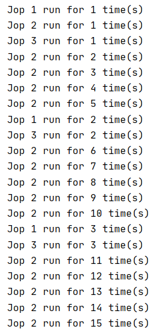

# Cron Scheduler with Java
## Description
A cron scheduler that takes a `job` object specified with `expectedInterval` to run
within , `frequency` the period to run the job every `period` 
## Technical Decision
the `Cron Scheduler` uses `ScheduledExecutorService` object to manage scheduled jobs  
the `Job` object implements `Runnable` so `Executor` can run this job  
and takes the required job to do as a `Runnable` object 
  `Runnable` Object is wrapped with `JobTaskWrapper` function to monitor job time
  in `run` method job runs `JobTasWrapper` in another Executor (so as not to interrupt monitoring job) and runs a scheduled function after `ExpectedInterval` time, If the job task has not been done yet, it cancels it  
### another possible approaches
- Keeping Job running even it exceeded time  
- Extending `Job` calss and `Override` `JopTaskWrapper` and add your own monitoring
## Possible improvments
- Adding canceling handler
- Making job `Callable` and take possible returned value from it 
## Snippets
This a snippet 
Jop 1 and  job 3 with freq 10 seconds
  Job 2 with frequency 2 seconds 
